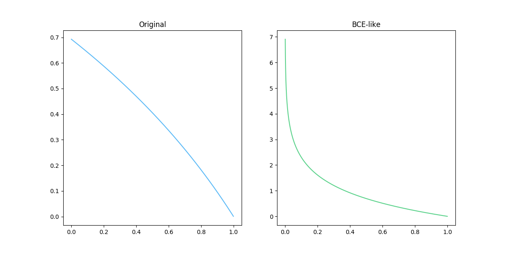
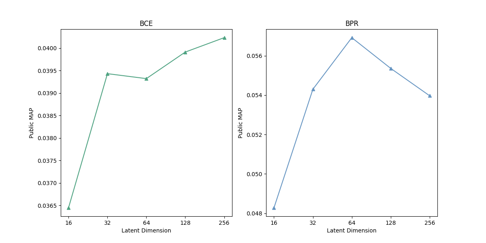

# Web Retrieval & Web Mining Programming HW2

###### By: Wu-Jun Pei (B06902029)

## Definition / Settings

#### Platform

- Python 3.8.2
- torch==1.5.0
- numpy==1.18.4

#### Common

- $M_I$：interaction matrix。維度是 $(N, M)$，其中 $N$ 是 user 數量、$M$ 是 item 數量。在這個 task 中 $N = 4454$、$M = 3260$。
- $\mathbf u_i$：user vector。user $i$ 有與哪些 item 互動過的 binary vector，即為 $M_I$ 的第 $i$ 個 row。$\tilde {\mathbf u}_i$ 為 $\mathbf u_i$ 過 matrix factorization 的 $F$ 為 embedded vector。
- $\mathbf i_j$：item vector。item $j$ 有與哪些 user 互動過的 binary vector，即為 $M_I$ 的第 $j$ 個 column。$\tilde {\mathbf i}_j$ 為 $\mathbf i_j$ 過 matrix factorization 的 $F$ 為 embedded vector。

#### Matrix Factorization

- Weight 是一個 $(K, F)$ 的矩陣，一開始從 $\mathcal N(0, 1)$ 產生而成。
- input 一個 user / item vector，output 一個 $F$ 維的 embedded vector。

#### Data Processing

<u>***Negative Sampling***</u>

採取以下兩種方式：

1. `fixed`：固定選取一定數量的 uninteracted items 作為 negative examples。
2. `sample`：將剩餘的所有的 uninteracted items 作為 negative examples。

<u>***Train / Validation Split***</u> 

- 固定選取 0.8 的 positive / negative example 作為 training data，剩下 0.2 作為 validation data。

## § Q1

> Describe your MF with BCE (e.g. parameters, loss function, negative sample method and MAP score on Kaggle public scoreboard)

#### Dataset

- 若為 `fixed` 將所有 positive / negative example 當作 dataset 下去 train。
- 若為 `sample`
    1. 決定 $r = \frac{\text{#negative}}{\text{#positive}}$
    2. 一個 epoch 總共選取所有的 positive example 以及 sample $(r \cdot \text{#positive})$ 個 negative examples。

後來皆使用 `fixed`，因為 `sample` 會無法 train 起來......

#### Loss Function

$$
BCELoss = \sum_{(u, i, y) \in \mathcal D} -[y \log (\tilde{\mathbf u}_u^T \tilde{\mathbf i}_i) + (1 - y) \log (1 - \tilde{\mathbf u}_u^T \tilde{\mathbf i}_i)]
$$

#### Model Parameters

- Latent Dimension $F$: **<u>128</u>**
- Gradient Descent Optimizer: **<u>Adam</u>**
    - Learning rate: <u>**5e-3**</u>
    - Weight decay (l2 regularization): **<u>1e-5</u>**
    - Learning rate scheduler: <u>**ReduceLROnPlateau**</u>
- \#Epochs: <u>**100**</u> (大概 70 個 epoch 就收斂了)

#### Result

|        Model         | MF-BCE-128 |
| :------------------: | :--------: |
|    Validation MAP    |  0.12756   |
| Kaggle Public Score  |  0.03991   |
| Kaggle Private Score |  0.03971   |

##### *Reference*

- [PyTorch - Binary Cross Entropy](https://pytorch.org/docs/stable/nn.html#bceloss)

## § Q2

> Describe your MF with BPR (e.g.parameters, loss function, negative sample method and MAP score on Kaggle public scoreboard)

#### Dataset

因為 BPR 要選取所有 user、該 user 的 positive example、negative example。如果只考慮原始的 `train.csv` 的話，總共會有 <u>**977,680,643**</u> 筆資料，要全部跑完實在是不太可能。因此，我採用的方法是：

- Uniformly sample $(user, pos)$ 的 example，之後在從該 user 的 negative items 中 uniformly sample 一個 $neg$。
- 每個 epoch sample 其中 **<u>1,000,000</u>** 筆 $(user, pos, neg)$。

#### Loss Function

$$
BPRLoss = \sum_{(u, p, n) \in \mathcal D} \log(2 - \sigma(\tilde{\mathbf u}_u^T \mathbf i_p - \tilde{\mathbf u}_u^T \mathbf i_n))
$$

我發現助教投影片上面的 loss function 是錯誤的，因為 positive 的分數和 negative 的分數就是要越大越好，而 sigmoid 和 log 都是遞增的函數，所以要加上負號才能 gradient descent。加上 2 是為了讓 log 的定義域在 $(1, 2)$ 之間，這樣 loss 都會是正的、越靠近 0 越好，方便觀察結果。

#### Model Parameters

- Latent Dimension $F$: **<u>64</u>**
- Gradient Descent Optimizer: **<u>Adam</u>**
    - Learning rate: <u>**1e-3**</u>
    - Weight decay (l2 regularization): **<u>1e-4</u>**
    - Learning Rate Scheduler: <u>**ReduceLROnPlateau**</u>

### Result

|        Model         | MF-MPR-64 |
| :------------------: | :-------: |
|    Validation MAP    |  0.34533  |
| Kaggle Public Score  |  0.05692  |
| Kaggle Private Score |  0.05331  |

##### <u>*Reference*</u>

- [BPR: Bayesian Personalized Ranking from Implicit Feedback](https://arxiv.org/pdf/1205.2618.pdf)

## § Q3

> Compare your results of Q1 and Q2. Do you think the BPR loss benefits the performance? If do, write some reasons of why BPR works well; If not, write some reasons of why BPR fails.

我認為 BPR 對於 MAP 的幫助很大，因為 BCE 只有看一個 $(user, item)$ 這樣的 pair 是不是 positive (有 interacted)，這樣有點把每個不同的 item 當成獨立的物品，並幫他們評一個「分數」，但那個分數可能並沒有那麼有意義。相較於 BCE，BPR 更關注在兩個物品的「比較」，因此他的排名做得比較好也是情有可原的！

我覺得我目前的 loss function 並沒有訂得很好，後來有想到一個與 BCE 比較像的 loss function 有一樣的功用：
$$
BPRLoss' = \sum_{(u, p, n) \in \mathcal D} -\log(\sigma(\tilde{\mathbf u}_u^T \mathbf i_p - \tilde{\mathbf u}_u^T \mathbf i_n))
$$
這個 loss function 其實就是 BCE 把 y 永遠設成 1 的版本（邏輯上來說也說得通，因為要讓分數拉越開越好，即 sigmoid 後越接近 1 越好）。他有一個很好的性質－凹向上，在做 gradient descent 時應該會有比較好的表現。然而因為時間的因素我沒有辦法時做出這個版本並比較差異 QQ

## § Q4

> Plot the MAP curve on testing data (Kaggle) for hidden factors 𝑑 = 16, 32, 64, 128 and describe your finding.

#### BCE

使用和上面一樣的參數，只有改變 latent dimension。

#### BPR

使用和上面一樣的參數，只有改變 latent dimension。

#### Result

##### Findings

- **BCE** 在同樣的參數下，16 維表現得真的差蠻多的，而整體的走勢有越來越好的趨勢，或許 BCE 這樣的 Model 有更多的 latent dimension 可以表現得再更好一點。
- **BPR** 在同樣的參數下，大概 64 維的表現最好，可能是因為 16 / 32 維的 latent dimension 不夠多，導致 underfitting 的情形，而 128 / 256 為甚至更多維的時候過於 overfitting，或許調整 l2 regularization 等其他參數可以改善也說不定。

## § Q5

> Change the ratio between positive and negative pairs, compare the results and discuss your finding. (Bonus 10%)

因為 BPR 的 dataset 是使用 sample 的方式跑的，所以這邊只做 BCE 的不同 negative sampling 的比例。

#### Sampling 方法

- 選取所有的 positive example，依照比例決定 negative example 的數量並 sample。
- 這樣可能會導致每個不同比例的 dataset 大小不一。

#### Result

| Pos : Neg | Training Accu. at last epoch | Validation Accu. at last epoch | Validation MAP | Kaggle Public MAP | Kaggle Private MAP |
| :-------: | :-----------------------------: | :--------------------------------: | :------------: | :---------------: | :----------------: |
| 1 : 0.25  |             0.8957              |               0.8711               |    0.09975     |      0.03580      |      0.03532       |
|  1 : 0.5  |             0.8530              |               0.8418               |    0.11654     |      0.03895      |      0.03999       |
|   1 : 1   |             0.8533              |               0.8360               |    0.12916     |      0.04077      |      0.04121       |
|   1 : 2   |             0.8682              |               0.8454               |    0.13254     |      0.04143      |      0.04118       |
|   1 : 4   |             0.8729              |               0.8663               |    0.13403     |      0.04033      |      0.04119       |

##### Findings

- 在 1 : 1 的情形時，validation accuracy 是最低的；而在比例比較懸殊時，validation accuracy 反而是比較高的。這個原因可能是因為 dataset 的某個 label 數量過多，而導致 model 傾向回答那個 label，此時 accuracy 自然就會高。
- 可以發現 validation MAP 的表現是從上而下單調遞增。我覺得可能的原因是因為看過比較多 negative example 的 model 可以學到比較多的資訊。且這個 ranking 的 task 只需要區分前 50 名的先後順序，不像一般的 classification 問題，就算大家的分數普遍 ≤ 0.5 也沒有關係，排出名次來就可以有比較好的表現。

